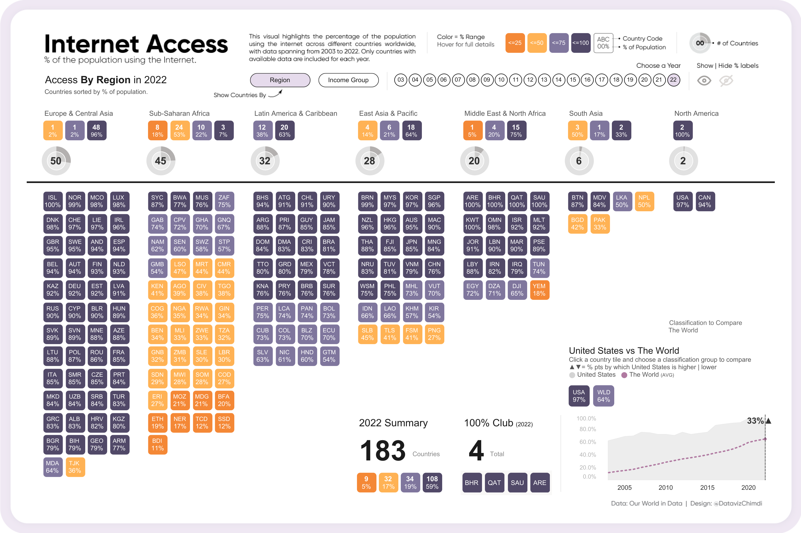

# Data Visualization

## Assignment 2: Good and Bad Data Visualization

### Requirements:

- Data visualizations are important tools for communication and convincing; we need to be able to evaluate the ways that data are presented in visual form to be critical consumers of information 
- To test your evaluation skills, locate two public data visualizations online, one good and one bad  
    - You can find data visualizations at https://public.tableau.com/app/discover or https://datavizproject.com/, or anywhere else you like! 
- For each visualization (good and bad):  
    - Explain (with reference to material covered up to date, along with readings and other scholarly sources, as needed) why you classified that visualization the way you did.
      ```
      Your answer...
      ```
    - How could this data visualization have been improved?  
      ```
      Your answer...      
      ```
- Word count should not exceed (as a maximum) 500 words for each visualization (i.e. 
300 words for your good example and 500 for your bad example)

Bad Visualization: Internet Access Across the World. 2003 to 2022
URL: https://public.tableau.com/app/profile/chimdi.nwosu/viz/MakeoverMondayWk45-InternetAccessAcrosstheWorld_2003to2022/Dashboard1


- Explain (with reference to material covered up to date, along with readings and other scholarly sources, as needed) why you classified that visualization the way you did:
I chose to classify this visualization as a bad one due to a number of factors which I will list below:
1) Information density - the visualization is far too much for our cognitive load, it crams a lot of information into a single image which makes it difficult for viewers to engage with and comprehend. The information lacks hierarchy which makes it difficult to see what the takeaways are and how to parse this information.
2) Color-coding issues - the gradient chosen for the percentages of internet adoption is not intuititve and seemingly far too course grained at times. The variations in color are sometimes not as clear as they should be which could present accessibility issues. The colours themselves do not add any interesting information or guide us towards a meaningful takeaway.
3) Context - the information is not contextualized properly, which could be because of the medium it's introduced in but also, it's not clear what the purpose of the visualization is to begin with.
4) Excessive detail - the country level data is too granular which makes it difficult to understand patterns within the chosen regions. The 100% club section and the line graph do not provide a meaningful enough context or narrative as to why they're important/relevant.  
5) Inappropriate label sizes - the region labels are too small a font and the separation line doesn't add to any clarity or clarify that those groups are the subgroups.

- How could this data visualization have been improved?
1) Focus on aggregating the data and then providing insights into individual countries as opposed to displaying all information at onces - this would give readers an ability to drill down for insights if they choose to do so.
2) Provide more information with annotations - this would allow the author to guide the readers to specific parts of the visualization that help them tell a story, and to provide additional context for the visualization.
3) Improve colour usage - while branding is important, it would be more helpful to have more finegrained colours usage and reliance on gradients within colours to help differentiate things (75% and up is too broad a category).


Good Visualization: 
URL: 

- Explain (with reference to material covered up to date, along with readings and other scholarly sources, as needed) why you classified that visualization the way you did:

- How could this data visualization have been improved?

### Why am I doing this assignment?:

- This assignment ensures active participation in the course, and assesses the learning outcomes
* Apply general design principles to create accessible and equitable data visualizations
* Use data visualization to tell a story

### Rubric:

| Component               | Scoring   | Requirement                                                 |
|-------------------------|-----------|-------------------------------------------------------------|
| Data viz classification and justification | Complete/Incomplete | - Data viz are clearly classified as good or bad<br />- At least three reasons for each classification are provided<br />- Reasoning is supported by course content or scholarly sources |
| Suggested improvements  | Complete/Incomplete | - At least two suggestions for improvement<br />- Suggestions are supported by course content or scholarly sources |

## Submission Information

🚨 **Please review our [Assignment Submission Guide](https://github.com/UofT-DSI/onboarding/blob/main/onboarding_documents/submissions.md)** 🚨 for detailed instructions on how to format, branch, and submit your work. Following these guidelines is crucial for your submissions to be evaluated correctly.

### Submission Parameters:
* Submission Due Date: `HH:MM AM/PM - DD/MM/YYYY`
* The branch name for your repo should be: `assignment-2`
* What to submit for this assignment:
    * This markdown file (assignment_2.md) should be populated and should be the only change in your pull request.
* What the pull request link should look like for this assignment: `https://github.com/<your_github_username>/visualization/pull/<pr_id>`
    * Open a private window in your browser. Copy and paste the link to your pull request into the address bar. Make sure you can see your pull request properly. This helps the technical facilitator and learning support staff review your submission easily.

Checklist:
- [ ] Create a branch called `assignment-2`.
- [ ] Ensure that the repository is public.
- [ ] Review [the PR description guidelines](https://github.com/UofT-DSI/onboarding/blob/main/onboarding_documents/submissions.md#guidelines-for-pull-request-descriptions) and adhere to them.
- [ ] Verify that the link is accessible in a private browser window.

If you encounter any difficulties or have questions, please don't hesitate to reach out to our team via our Slack at `#cohort-3-help`. Our Technical Facilitators and Learning Support staff are here to help you navigate any challenges.
